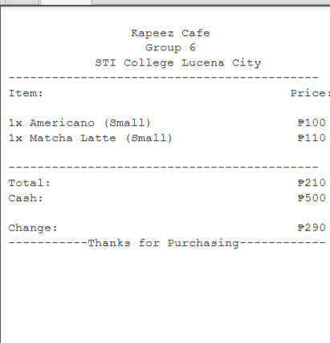

# ☕ Kapeez - Cafe Ordering System (JavaFX)

**Kapeez** is a simple cafe ordering system built using **JavaFX**.  
It was the updated version of my cafe ordering system as part of our programming course to simulate a real-world coffee shop experience.

Users can select drinks, view their orders, and generate a digital receipt.

---

## 📸 Screenshots

### ⏳ Loading Screen  
Splash screen while the app initializes.  

### 🖥️ Main Interface  
Where customers choose coffee and other items.  

### 🧾 Receipt View  
Receipt display showing all selected items and the total amount.  

